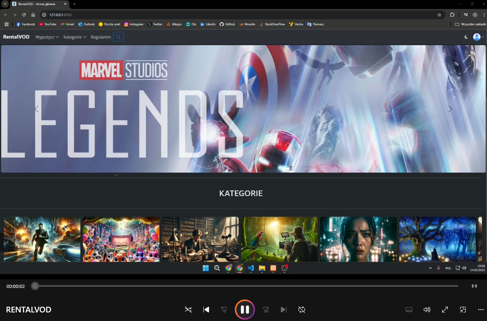
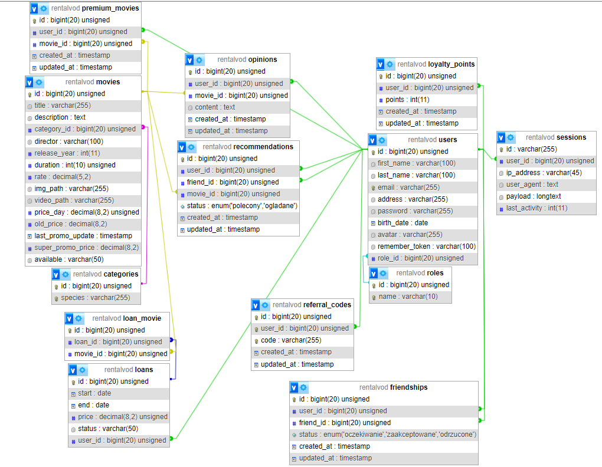

# Project Documentation 

**Author:** Dawid Olko, 125148  
**Course and Year:** Computer Science, 2nd Year, Full-time (3.5-year)  
**Project Topic:** VOD Movie Rental Platform (LARAVEL)

## Table of Contents

1. [Introduction](#introduction)
    - Scope of the Application
    - Main Technical Elements
2. [Tools and Technologies](#tools-and-technologies)
    - Laravel Framework
    - Database
    - Database Server Connection Configuration
    - Frontend
    - Middleware
    - Controllers
    - Models
    - Services
    - Data Validation
    - Data Seeding
3. [Database](#database)
    - ERD Diagram _(here put image)_
    - Description of the Database Solutions
        - MOVIES
        - USERS
        - LOANS
        - LOAN_MOVIE
        - OPINIONS
        - CATEGORIES
        - PREMIUM_MOVIES
        - REFERRAL_CODES
        - LOYALTY_POINTS
        - RECOMMENDATIONS
        - FRIENDSHIPS
    - Migrations
    - Seeders
    - Description of an Example Relationship in Models
4. [GUI](#gui)
    - Description of the User Interface
    - Main Application Views
5. [Running the Application](#running-the-application)
    - Requirements
    - Steps for the First Run
    - Steps for Subsequent Runs
6. [Application Functionalities](#application-functionalities)
    - Login and Registration
    - Browsing Resources
    - Administration Management
    - Functionalities for Logged-in Users
    - Movie Rental Process
7. [Data Validation](#data-validation)
    - Validation for Various Request Types

# Video on youtube:

<a href="https://www.youtube.com/watch?v=uPIp8MLDDec">
  
</a>

---

## 1. Introduction

This project involves the creation of a web application for renting VOD (Video on Demand) movies using the Laravel framework. The application is designed for a small business that rents movies online. Users can browse the catalog of available movies, rent them for a specified period, and manage their orders and personal data. The application automates the entire movie rental process, including cost calculation, promotion handling, and loyalty points awarding.

### Scope of the Application

The application includes the following functionalities:

1. **User Registration and Login:**

    - Only registered and logged-in users can access the full features of the application, such as renting movies.
    - New users can register on their own, and after registration, they gain access to their account.

2. **Movie and Order Management by the Administrator:**

    - The administrator can add, edit, and delete movies in the database.
    - The administrator also manages orders and can update or delete user data.

3. **Business Process Automation:**

    - The application automatically calculates the rental cost of movies, taking into account dynamic promotional prices.
    - Awarding loyalty points for rentals and managing their balance is automated.
    - Automatic handling of movie availability and other catalog management operations.

4. **Functionalities for Users:**

    - Users can browse available movies using various filters and sorting options.
    - They can add movies to a cart, rent them, and manage their orders.
    - Users have access to their profile, where they can edit their data and view their rental history.

5. **User Interface:**

    - The application features a responsive user interface designed using the Blade templating engine.
    - The interface includes various elements such as forms, buttons, lists, and dynamic elements to enhance the user experience.

6. **Security:**
    - The application implements authentication and authorization mechanisms to ensure the security of user data.
    - All sensitive operations are secured, and access to administrative functions is restricted to authorized users.

### Main Technical Elements

-   **Framework:** Laravel 11.x
-   **Database:** MySQL
-   **Front-end:** Blade (templates), CSS, JavaScript
-   **Backend:** PHP, Laravel
-   **Other Technologies:** Faker (for data seeding and table migrations), Bootstrap (for interface styling)

The "RentalVOD" application is designed to provide ease of use for both customers and administrators. Automating many business processes greatly simplifies the management of orders and the movie catalog, enhancing the overall efficiency of the system.

---

## 2. Tools and Technologies

### Laravel Framework

Laravel is a popular web application framework based on PHP, created by Taylor Otwell. It is an advanced tool that enables rapid and efficient development of scalable web applications using modern programming techniques and design patterns, which facilitates writing clean and maintainable code.

In this project, we use Laravel version 11.x, which offers numerous functionalities and improvements over previous versions. Laravel is distributed under the MIT license, allowing free use, modification, and distribution. The official Laravel documentation is available on the [Laravel Docs](https://laravel.com/docs) website.

### Database

The application uses the MySQL database engine. MySQL is open-source software available under the GNU General Public License (GPL). You can download the latest version of MySQL from the [MySQL Downloads](https://dev.mysql.com/downloads/) page.

#### Database Server Connection Configuration

To configure the connection to the MySQL server, edit the `config/database.php` configuration file. In this file, the `connections` section allows you to define connection settings for different environments (e.g., development, production).

**Example MySQL connection configuration:**

```php
'connections' => [
    'mysql' => [
        'driver' => 'mysql',
        'host' => env('DB_HOST', '127.0.0.1'),
        'port' => env('DB_PORT', '3306'),
        'database' => env('DB_DATABASE', 'rentalVOD'),
        'username' => env('DB_USERNAME', 'your_username'),
        'password' => env('DB_PASSWORD', 'your_password'),
        'charset' => 'utf8mb4',
        'collation' => 'utf8mb4_unicode_ci',
        'prefix' => '',
        'strict' => true,
        'engine' => null,
    ],
],
```

Set the appropriate values for the `host`, `port`, `database`, `username`, and `password` parameters according to your MySQL server configuration.

### Frontend

The application uses Blade as its templating engine for generating HTML views. Blade is easy to use yet powerful, allowing full use of PHP without the complications of other templating engines. Combined with CSS and JavaScript, it provides a dynamic and responsive user interface.

### Middleware

In Laravel, middleware is used to perform intermediary tasks during the processing of HTTP requests. In this project, middleware is used to check user permissions—for example, verifying if the user is an administrator.

### Controllers

Controllers in Laravel organize the application logic and handle HTTP requests. For example, an `AdminController` might manage users and movies.

### Models

Models in Laravel are responsible for database interactions. A sample `Movie` model might look like this:

```php
<?php

namespace App\Models;

use Illuminate\Database\Eloquent\Model;

class Movie extends Model
{
    // Model code here
}
```

### Services

The application uses services that contain business logic, such as calculating dynamic movie prices.

### Data Validation

Laravel offers an easy way to validate data using form requests. For example, validation for adding a new movie might be written as:

```php
public function rules()
{
    return [
        'title' => 'required|string|max:255',
        'description' => 'required|string',
        // additional rules...
    ];
}
```

### Data Seeding

To load sample data into the database, seeders are used. A sample seeder might be:

```php
public function run()
{
    \App\Models\Movie::factory(50)->create();
}
```

Each of the above technical elements and tools is carefully integrated into the application, ensuring smooth operation, ease of maintenance, and future scalability.

---

## 3. Database

### ERD Diagram



### Description of the Database Solutions

**VOD MOVIE RENTAL:**  
The rental service for which the database is prepared is called RentalVOD.

**MOVIES:**  
The `movies` table stores all movies with key data about each. The `available` column indicates whether a movie is available for rental ("available") or currently rented ("unavailable"). The table also contains columns such as `title`, `description`, `director`, `release_year`, `price_day`, `img_path`, and `category_id`.

**USERS:**  
The `users` table stores information about users who have registered on the platform. It includes detailed user data such as `first_name`, `last_name`, `email`, `address`, `city`, `password`, `role_id` (for user permissions), `avatar`, and `loyalty_points`.

**LOANS:**  
The `loans` table records rental information including the start date (`start_date`), end date (`end_date`), rental status (`status`), and rental price (`price`). The `user_id` column stores the identifier of the user who made the rental.

**LOAN_MOVIE:**  
This pivot table connects the `loans` and `movies` tables, allowing the storage of which movies were rented in a particular transaction. It contains the `loan_id` and `movie_id` columns, which form the link between these tables.

**OPINIONS:**  
The `opinions` table stores user reviews of rented movies. It includes columns such as `content` (review text), `movie_id`, and `user_id` to link the review to the appropriate movie and user.

**CATEGORIES:**  
The `categories` table stores information about movie categories. The `species` column holds the category name.

**PREMIUM_MOVIES:**  
This table stores information about movies upgraded to premium quality by the user. It contains `user_id`, `movie_id`, and timestamps, showing when the premium upgrade was purchased.

**REFERRAL_CODES:**  
This table contains attributes like `user_id`, `code`, and timestamps. Each user has their own promotional code; when someone registers using that code, they receive 20 loyalty points on their account.

**LOYALTY_POINTS:**  
The `loyalty_points` table records the loyalty points for a user account, which can be exchanged for premium quality or used to purchase a movie. Attributes include `user_id`, `points`, and timestamps.

**RECOMMENDATIONS:**  
This table represents movies recommended by friends. It includes attributes such as `user_id`, `friend_id`, `movie_id`, `status`, and timestamps.

**FRIENDSHIPS:**  
The `friendships` table stores `user_id`, `friend_id`, and `status`. It is used for managing friend connections.

### Migrations

Migrations in Laravel are used to manage the database structure. They allow you to create, modify, and delete tables and other database elements using PHP code, which simplifies managing the database during project development.

Each migration extends the `Migration` class and contains two methods: `up()` and `down()`. The `up()` method is executed when running the migration to create the database structure, while the `down()` method is executed when rolling back the migration to remove the previously created elements.

### Seeders

Seeders in Laravel are used to fill database tables with sample data. They are useful during testing and development as they allow quick loading of initial data. Seeders are particularly handy when sample data is needed for testing, system initialization, or demonstration purposes.

### Description of an Example Relationship in Models

Between the `movies` and `loans` tables, there exists a many-to-many relationship via the `loan_movie` pivot table. This relationship allows one movie to be included in many rentals, and one rental to contain many movies.

In the `Movie` model, a `loans()` method is defined to establish a many-to-many relationship with the `Loan` model using the `belongsToMany()` method. It specifies the pivot table `loan_movie` and sets the appropriate foreign key names.

Similarly, in the `Loan` model, a `movies()` method is defined to establish the relationship with the `Movie` model. This method also uses `belongsToMany()`, specifies the `loan_movie` pivot table, and sets the corresponding foreign key names.

By defining these relationships, you can easily access the related movies for a given rental via the `movies` attribute on a `Loan` object, and vice versa.

---

## 4. GUI

### Description of the User Interface

The user interface (GUI) of the "VOD Movie Rental" application is designed with ease of use and aesthetics in mind. The application uses Blade as the templating engine, enabling dynamic generation of HTML views and seamless integration with the Laravel backend. The entire interface is built using modern front-end technologies, such as Bootstrap for styling and JavaScript for dynamic interactions.

### Main Application Views

1. **Home Page (`home.blade.php`):**  
   The home page is the first view a user sees upon entering the application. It includes:

    - **Header:** Contains the application logo and navigation links to different sections.
    - **Carousel:** A dynamic slider displaying promoted movies.
    - **Categories:** A section displaying various movie categories available for rental, with options to filter movies by category.
    - **Movie List:** A presentation of selected movies currently available for rental. Movies are shown as cards with an image, title, category, director, release year, and rating.
    - **Slider of the 10 Most Popular Movies:** A section showcasing 10 movies with images that indicate the movie's location, availability, or title.
    - **Recommended Movies Section:** A section displaying movies that are most frequently recommended by users.

2. **Login (`login.blade.php`) and Registration (`register.blade.php`) Pages:**  
   These views allow users to log into the application and register new accounts:

    - **Login Form:** Allows users to enter their email and password to access their account.
    - **Registration Form:** Enables new users to create an account by providing details such as first name, last name, email, address, city, and password.

3. **Administrator Panel (`admin.blade.php`):**  
   The administrator panel is accessible only to users with administrator privileges and includes tools for managing the application:

    - **User Management:** A view that allows the administrator to view, edit, and delete user accounts.
    - **Movie Management:** A view that enables adding new movies, editing existing movies, and deleting movies from the database.
    - **Order Management:** A view for reviewing and managing orders placed by users.
    - **Admin Settings:** A view for enabling/disabling promotions and configuring the algorithm for recommended movies.

4. **User Profile Page (`profile.blade.php`):**  
   The user profile page allows users to view and edit their personal data and rental history:

    - **User Data:** A section displaying basic user information with options to edit it.
    - **Rental History:** A list of movies rented by the user, including details such as rental and return dates and rental status.

5. **Cart (`cart.blade.php`):**  
   The cart view allows users to see the movies added to their cart, manage rental dates, and finalize orders:

    - **Movie List in Cart:** Displays all movies in the cart with their price and selected rental dates.
    - **Finalize Order Button:** Allows the user to proceed to the ordering and payment process.

6. **Movie Detail Page (`show.blade.php`):**  
   The detailed movie view displays complete information about a selected movie:

    - **Movie Information:** Includes the title, description, director, release year, rating, category, and rental price.
    - **User Reviews:** A section showing reviews from other users who have rented the movie, with the option to add a review.
    - **Add to Cart Button:** Allows the user to add the movie to their cart for rental.

7. **Terms and Conditions Page (`regulamin.blade.php`):**  
   A page displaying the terms and conditions that govern the use of the service and the rental conditions.

### Styling and Responsiveness

The application is fully responsive, meaning the interface adapts to different screen sizes—from desktop computers to mobile devices. The styling is implemented using Bootstrap, ensuring a consistent and aesthetically pleasing appearance across all elements.

### Dynamic Elements

-   **JavaScript:** Used for handling dynamic elements such as carousels, forms, action buttons, and other interactive components.
-   **Animations:** Subtle animations add a dynamic touch to the interface, enhancing the overall user experience.

---

## 5. Running the Application

### Requirements

1. **XAMPP Package:**  
   XAMPP includes the Apache server, MySQL database, and PHP interpreter, all essential for running a Laravel application. You can download XAMPP from the [XAMPP Download](https://www.apachefriends.org/download.html) page.

2. **Composer:**  
   Composer is a dependency management tool for Laravel. It is used to install all necessary libraries and dependencies. Download Composer from the [Composer Download](https://getcomposer.org/download/) page.

3. **Visual Studio Code:**  
   Visual Studio Code is a popular code editor that facilitates code editing. Download it from the [VS Code Download](https://code.visualstudio.com/Download) page.

### Steps for the First Run

1. **Start XAMPP:**

    - After installing XAMPP, launch it and enable the MySQL and Apache modules.
    - XAMPP provides a graphical interface for easy management of server services.

2. **Navigate to the Project Folder and Run `start.bat`:**

    - In the project folder, there is a file named `start.bat` that automates the configuration and launch of the application.
    - Open the project folder and run `start.bat` as an administrator. For macOS and Linux, use the `start.sh` file (navigate to the correct path in the directory tree and run `bash start.sh`). This script performs the following operations:
        - Creates the `rentalVOD` database.
        - Copies the configuration file `.env.example` to `.env`.
        - Installs all dependencies via `composer install`.
        - Requires additional packages such as `stripe/stripe-php`, `bensampo/laravel-enum`, and `hoa/ruler`.
        - Generates the application key using `php artisan key:generate`.
        - Creates a symbolic link for file storage using `php artisan storage:link`.
        - Migrates the database and seeds initial data using `php artisan migrate:fresh --seed`.
        - Installs the `barryvdh/laravel-ide-helper` package to enhance the development experience.
        - Launches the local development server using `php artisan serve`.
        - Opens the browser at [http://127.0.0.1:8000](http://127.0.0.1:8000).
        - Opens the project in Visual Studio Code.

3. **Run the Built-in Development Server:**
    - Once `start.bat` has been executed, the application should be accessible at [http://127.0.0.1:8000](http://127.0.0.1:8000).

### Steps for Subsequent Runs

1. **Navigate to the Project Directory:**

    - Open a terminal or command prompt.
    - Change to the directory containing the Laravel project.

2. **Run the Built-in Development Server:**
    - Start the development server with the command:
    ```bash
    php artisan serve
    ```
    - The application will then be available at [http://127.0.0.1:8000](http://127.0.0.1:8000).

---

## 6. Application Functionalities

### Login and Registration

**Login:**

-   On the login page, the user is prompted to enter their email address and password.
-   The entered data is validated for correct format and verified against the database to ensure an account with the provided credentials exists.
-   If the data is correct, the user is redirected to the protected area of the application, where they can access their account.
-   If the data is incorrect, an error message is displayed and the user is prompted to re-enter their login credentials.

**Registration:**

-   On the registration page, the user is asked to provide their email, first name, last name, a valid address, and password.
-   The provided data is validated for proper format and checked for uniqueness (e.g., ensuring the email is not already in use).
-   The information is saved to the database along with the login credentials.
-   Upon successful registration, the user is automatically logged in and redirected to the home page.

**Example Users:**

-   **Administrator:**
    -   Email: jan.kowalski@example.com
    -   Password: Admin12345&
-   **Regular User:**
    -   Email: anna.nowak@example.com
    -   Password: password12345&A

### Browsing Resources

**Home Page:**

-   The home page displays promoted movies in a carousel format.
-   It includes sections with popular movie categories and a selection of movies available for rental.

**Movie Catalog:**

-   Users can browse the full movie catalog using filters and sorting options by category, release year, rating, etc.
-   A search function allows users to find movies based on keywords.

**Movie Details:**

-   Each movie has a detailed page displaying complete information such as description, director, release year, rating, and availability.
-   Users can add reviews and view reviews submitted by others.

**Terms and Conditions:**

-   A dedicated page displays the terms and conditions governing the use of the service and rental policies.

### Administration Management

**CRUD for Movies:**

-   **Adding Movies:** The administrator can add new movies to the database by filling out a form with the movie details.
-   **Editing Movies:** The administrator can edit existing movies by updating their data.
-   **Deleting Movies:** The administrator can remove movies from the database.

**User Management:**

-   **Adding and Editing Users:** The administrator can add new users and modify existing user data.
-   **Deleting Users:** The administrator can delete user accounts.

**Rental Management:**

-   **Viewing Orders:** The administrator can view all orders placed by users, manage their status, and review rental details.
-   **Handling Issue Reports:** The administrator has access to a panel to view and resolve user-reported issues.

### Functionalities for Logged-in Users

**User Profile:**

-   Logged-in users can access their profile to view and edit their personal information and rental history.
-   Options are available to update personal data and change the password.

**Cart:**

-   Users can add movies to the cart, manage rental dates, and finalize their orders.
-   The cart displays a list of movies, the total rental price, and the selected rental dates.

**Reviews:**

-   Users can submit reviews for rented movies, which are visible to other users.
-   They can also view and manage their own reviews.

### Movie Rental Process

**Adding to Cart:**

-   The user adds movies to the cart by selecting the desired rental dates.
-   The cart calculates and displays the total rental price based on the number of days and the selected movies.

**Finalizing the Order:**

-   After confirming the cart, the user proceeds to the payment process.
-   Payment can be made using loyalty points or a credit card.

**Rental History:**

-   The user can view their rental history, check the status of their orders, and review details of each rental.

---

## 7. Data Validation

In the "VOD Movie Rental" application, data validation is a crucial component that ensures the correctness and security of operations performed by users. Laravel provides a robust validation mechanism to easily define rules for various types of requests.

### Validation for Various Request Types

1. **Add Category Request (`AddCategoryRequest`):**  
   **Description:** Request to add a new movie category.  
   **Validation Rules:**

    - `genre`: required, string, maximum 255 characters, unique in the `categories` table (column `species`).  
      **Example Code:**

    ```php
    public function rules()
    {
        return [
            'genre' => 'required|string|max:255|unique:categories,species',
        ];
    }
    ```

2. **Add Movie Request (`AddMovieRequest`):**  
   **Description:** Request to add a new movie to the database.  
   **Validation Rules:**

    - `title`: required, string, maximum 255 characters.
    - `description`: required, string.
    - `category_id`: required, integer.
    - `director`: required, string, maximum 255 characters.
    - `release_year`: required, integer, minimum 0.
    - `duration`: required, numeric (with optional decimals), minimum 0.
    - `rate`: required, numeric, minimum 0.
    - `video_path`: required, string.
    - `price_day`: required, numeric, minimum 0.
    - `available`: required, one of the values: "available", "unavailable".
    - `img_path`: optional, image file (jpeg, png, jpg, gif), maximum size 2048 kB.  
      **Example Code:**

    ```php
    public function rules()
    {
        return [
            'title' => 'required|string|max:255',
            'description' => 'required|string',
            'category_id' => 'required|integer',
            'director' => 'required|string|max:255',
            'release_year' => 'required|integer|min:0',
            'duration' => 'required|numeric|min:0',
            'rate' => 'required|numeric|min:0',
            'video_path' => 'required|string',
            'price_day' => 'required|numeric|min:0',
            'available' => 'required|in:available,unavailable',
            'img_path' => 'nullable|image|mimes:jpeg,png,jpg,gif|max:2048',
        ];
    }
    ```

3. **Authenticate Request (`AuthenticateRequest`):**  
   **Description:** Request for user login.  
   **Validation Rules:**

    - `email`: required, valid email format, maximum 255 characters.
    - `password`: required, string, minimum 8 characters, must include lowercase and uppercase letters, digits, and a special character.  
      **Example Code:**

    ```php
    public function rules()
    {
        return [
            'email' => 'required|email|max:255',
            'password' => 'required|string|min:8|regex:/^(?=.*[a-z])(?=.*[A-Z])(?=.*\d)(?=.*[\W_]).+$/',
        ];
    }
    ```

4. **Change Password Request (`ChangePasswordRequest`):**  
   **Description:** Request to change the user's password.  
   **Validation Rules:**

    - `current_password`: required.
    - `new_password`: required, string, minimum 8 characters, must include lowercase and uppercase letters, digits, and a special character, with confirmation.  
      **Error Messages:**
    - `new_password.min`: "The password must be at least 8 characters long."
    - `new_password.confirmed`: "Password confirmation does not match."
    - `new_password.regex`: "The password must include at least one uppercase letter, one lowercase letter, one digit, and one special character."  
      **Example Code:**

    ```php
    public function rules()
    {
        return [
            'current_password' => 'required',
            'new_password' => 'required|string|min:8|confirmed|regex:/^(?=.*[a-z])(?=.*[A-Z])(?=.*\d)(?=.*[\W_]).+$/',
        ];
    }
    ```

5. **Register Request (`RegisterRequest`):**  
   **Description:** Request to register a new user.  
   **Validation Rules:**

    - `first_name`: required, string, maximum 100 characters, letters only.
    - `last_name`: required, string, maximum 100 characters, letters only.
    - `email`: required, valid email format, maximum 255 characters, unique in the `users` table.
    - `password`: required, confirmation required, minimum 8 characters, must include lowercase and uppercase letters, digits, and a special character.
    - `address`: required, string, maximum 255 characters.  
      **Error Messages:**
    - `first_name.required`: "First name is required."
    - `last_name.required`: "Last name is required."
    - `email.required`: "Email address is required."
    - `email.email`: "Please provide a valid email address."
    - `email.unique`: "The provided email address is already in use."
    - `password.required`: "Password is required."
    - `password.confirmed`: "Passwords do not match."
    - `password.min`: "The password must be at least 8 characters long."
    - `password.regex`: "The password must include lowercase and uppercase letters, digits, and a special character."
    - `address.required`: "Address is required."  
      **Example Code:**

    ```php
    public function rules()
    {
        return [
            'first_name' => 'required|string|max:100|regex:/^[A-Za-z]+$/',
            'last_name' => 'required|string|max:100|regex:/^[A-Za-z]+$/',
            'email' => 'required|email|max:255|unique:users,email',
            'password' => 'required|confirmed|string|min:8|regex:/^(?=.*[a-z])(?=.*[A-Z])(?=.*\d)(?=.*[\W_]).+$/',
            'address' => 'required|string|max:255',
        ];
    }
    ```

6. **Store Opinion Request (`StoreOpinionRequest`):**  
   **Description:** Request to add a new movie review.  
   **Validation Rules:**

    - `content`: required, at least 1 character.
    - `movie_id`: required, must exist in the `movies` table.  
      **Error Messages:**
    - `content.required`: "The review content is required."
    - `content.min`: "The review content must be at least 1 character."
    - `movie_id.required`: "Movie ID is required."
    - `movie_id.exists`: "The specified movie does not exist."  
      **Example Code:**

    ```php
    public function rules()
    {
        return [
            'content' => 'required|string|min:1',
            'movie_id' => 'required|exists:movies,id',
        ];
    }
    ```

7. **Update Address Request (`UpdateAddressRequest`):**  
   **Description:** Request to update the user's address.  
   **Validation Rules:**

    - `address`: required, string, maximum 255 characters, allowing only letters, digits, spaces, and the characters `, . -`.  
      **Error Messages:**
    - `address.required`: "Address is required."
    - `address.regex`: "Address can only include letters, digits, spaces, and the characters , . -."  
      **Example Code:**

    ```php
    public function rules()
    {
        return [
            'address' => 'required|string|max:255|regex:/^[A-Za-z0-9 ,.\-]+$/',
        ];
    }
    ```

8. **Update Avatar Request (`UpdateAvatarRequest`):**  
   **Description:** Request to update the user's avatar.  
   **Validation Rules:**

    - `avatar`: required, image file, formats: jpeg, png, jpg, gif, svg, maximum 2048 kB.  
      **Error Messages:**
    - `avatar.required`: "You must select a file."
    - `avatar.image`: "The file must be an image."
    - `avatar.mimes`: "Only files in formats jpeg, png, jpg, gif, svg are allowed."
    - `avatar.max`: "The maximum file size is 2048 kB."  
      **Example Code:**

    ```php
    public function rules()
    {
        return [
            'avatar' => 'required|image|mimes:jpeg,png,jpg,gif,svg|max:2048',
        ];
    }
    ```

9. **Update Cart Request (`UpdateCartRequest`):**  
   **Description:** Request to update the rental dates in the cart.  
   **Validation Rules:**

    - `start`: required, date.
    - `end`: required, date, must be the same or later than `start`.  
      **Error Messages:**
    - `start.required`: "Start date is required."
    - `start.date`: "Start date must be a valid date."
    - `end.required`: "End date is required."
    - `end.date`: "End date must be a valid date."
    - `end.after_or_equal`: "End date cannot be earlier than the start date."  
      **Example Code:**

    ```php
    public function rules()
    {
        return [
            'start' => 'required|date',
            'end' => 'required|date|after_or_equal:start',
        ];
    }
    ```

10. **Update Movie Request (`UpdateMovieRequest`):**  
    **Description:** Request to update movie details.  
    **Validation Rules:**

    - `title`: required, string, maximum 255 characters.
    - `description`: required, string.
    - `director`: required, string, maximum 255 characters.
    - `release_year`: required, integer, minimum 0.
    - `duration`: required, numeric (with optional decimals), minimum 0.
    - `rate`: required, numeric, minimum 0.
    - `video_path`: required, string.
    - `price_day`: required, numeric, minimum 0.
    - `available`: required, one of the values: "available", "unavailable".
    - `img_path`: optional, image file (jpeg, png, jpg, gif), maximum size 2048 kB.  
      **Example Code:**

    ```php
    public function rules()
    {
        return [
            'title' => 'required|string|max:255',
            'description' => 'required|string',
            'director' => 'required|string|max:255',
            'release_year' => 'required|integer|min:0',
            'duration' => 'required|numeric|min:0',
            'rate' => 'required|numeric|min:0',
            'video_path' => 'required|string',
            'price_day' => 'required|numeric|min:0',
            'available' => 'required|in:available,unavailable',
            'img_path' => 'nullable|image|mimes:jpeg,png,jpg,gif|max:2048',
        ];
    }
    ```

11. **Update User Request (`UpdateUserRequest`):**  
    **Description:** Request to update user information.  
    **Validation Rules:**
    - `first_name`: required, string, maximum 100 characters.
    - `last_name`: required, string, maximum 100 characters.
    - `email`: required, valid email, maximum 255 characters, unique in the `users` table except for the current user.
    - `address`: required, string, maximum 255 characters.  
      **Example Code:**
    ```php
    public function rules()
    {
        return [
            'first_name' => 'required|string|max:100',
            'last_name' => 'required|string|max:100',
            'email' => 'required|email|max:255|unique:users,email,' . $this->user()->id,
            'address' => 'required|string|max:255',
        ];
    }
    ```

### Summary

The validation mechanisms in the "VOD Movie Rental" application ensure that the data entered by users is correct and secure at every stage of the application. This helps the application run smoothly and safely, minimizing errors and providing a positive user experience.

---
